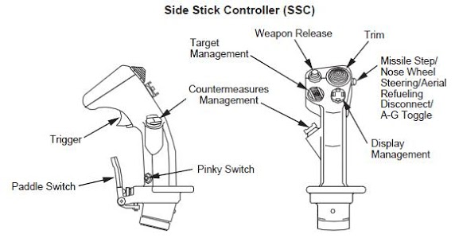
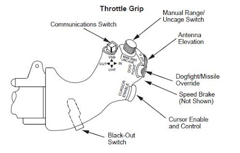
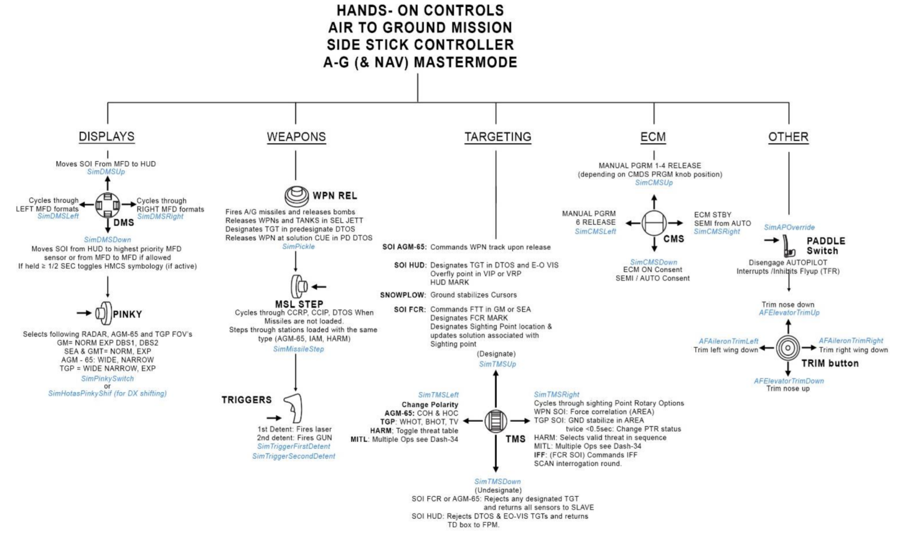
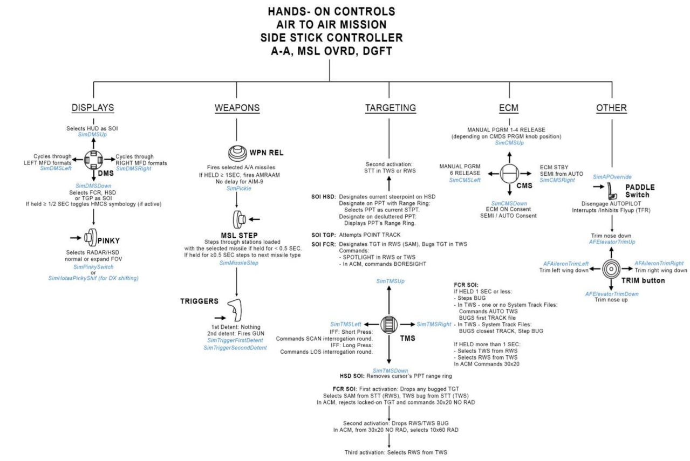
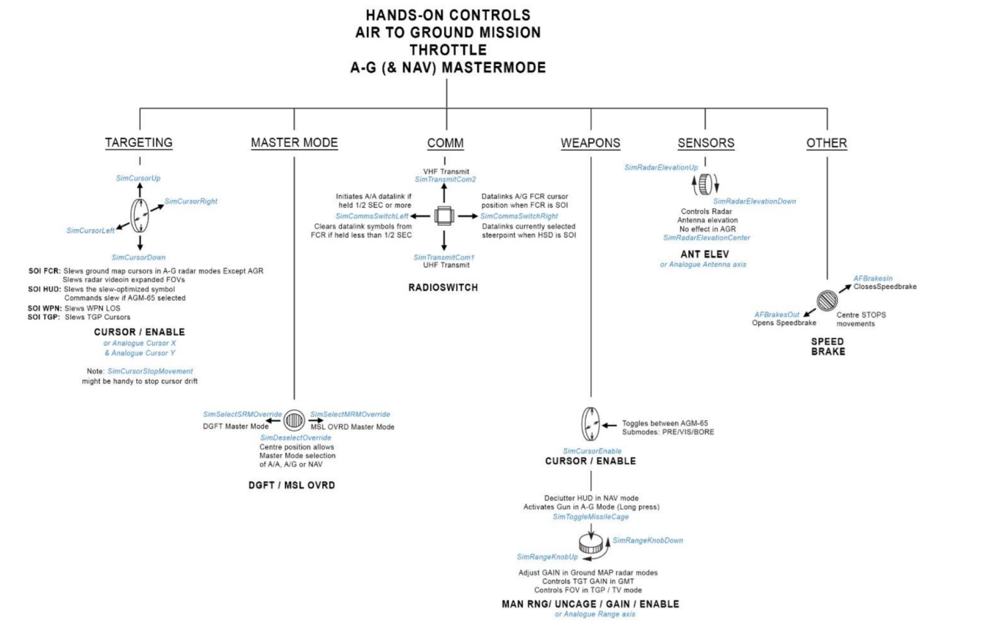
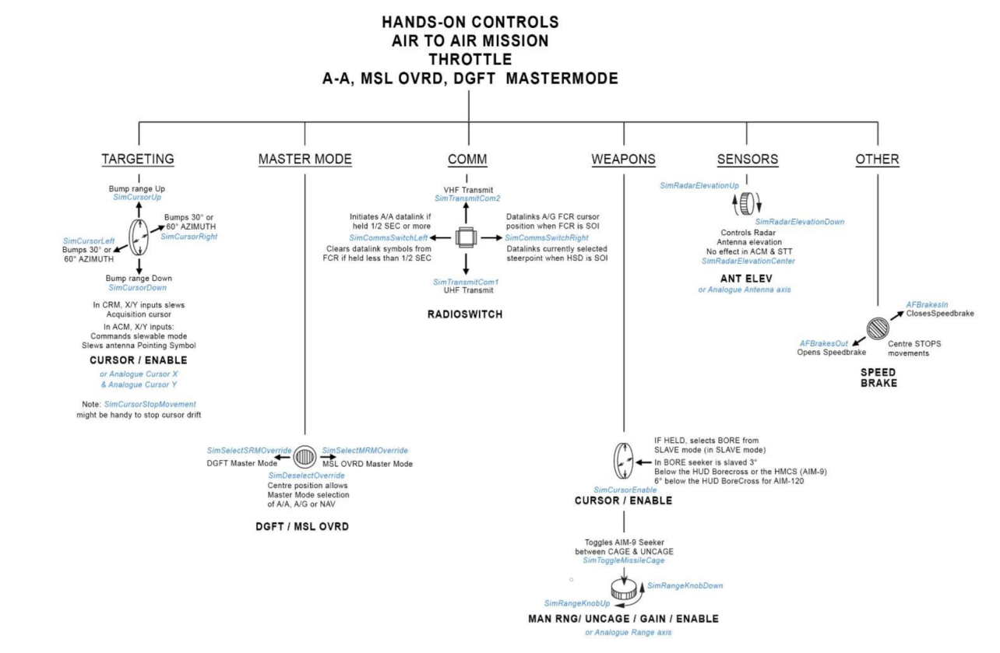

<font size="48">FalconBMS Quick Start Guide</font>

|Version|Date|
|-|-|
|v0.01|2019.07.20|

# What is FalconBMS

Falcon BMS (hereinafter BMS) is software developed based on source code leaked from MicroProse's flight simulator "Falcon 4.0" released in 1998.

Falcon 4.0 recreates the flight characteristics and avionics of the Lockheed Martin F-16C block 50/52, and has been widely adopted by combat sim users by the implemented dynamic campaign.

After the closure of the development studio due to the disappearance of the MicroProse brand, the volunteers of the community continued updating based on the leaked source code, and Falcon 4.0 has evolved into various versions and developed over approximately 20 years.

BenchmarkSims is the only survivor of such a volunteer development team, and develops and releases FalconBMS under the license of BillionSoft, the current owner of Falcon 4.0.

<div style="page-break-before:always"></div>

# What is Dynamic Campaign

Falcon 4.0 is like a flight simulator that can operate a fighter as a part of a strategy simulation game.

In Dynamic Campaign, every country of every coalitions, all forces, ground, sea, air, fight against each other. Missions will be automatically generated and fragged by HeadQuater AI, and each AI pilot joins there flight. You can take a sheet for those generated mission, and fly with them, or fly with your human friend. Or you can plan your own mission. You can debate and plan a mission with your mate in MP too. Every mission will be unique as they are not scripted but a result of entire war simulation, and affects entire situation, thus future missions.

Keep in mind there is a logistics, don't get your ammunition storage bombed or you will be run out of missiles.

<div style="page-break-before:always"></div>

# What BMS has been updated

## Flight Model

BMS coded a completely new flight model which do a calculation outside of legacy Falcon4.0 code but import position updates.
> I think that trying to plug new lines in the existing code could have been a wrong choice, therefore I decided to start from a blank page and use a dedicated data file format. The idea at this stage was to develop a new FM code that can be completely autonomous from F4. Then the new code would be fed values coming from F4 (atmosphere, terrain, weapons, fuel, etc) and would export output values into the F4 code (world positions, speeds, angles, etc).

You can read articles about BMS FM at official website
[FLIGHT MODEL](https://www.benchmarksims.org/forum/content.php?45-documentation)

also check Mav-JP's description
[BMS : F16 FLIGHT MODELING](https://www.reddit.com/r/falconbms/comments/bptu8e/bms_f16_flight_modeling/)

## AI

### BVR

[WIP]

### SAM

[WIP]

## ATC

[WIP]

## IFF

[WIP]

- every IFF interrogation and reply might be intercepted by the enemy.
  > That can be by an enemy ground station - anything with a radar - or ELINT flights. It depends on the emitting aircraft altitude and ELINT item position. That will make the emitting aircraft spotted for a while. Be aware of this, whether on the transponder side (dont blast every mode all the time, especially in a NOE penetration), or the interrogator side (dont interrogate in SCAN every second if you want your teammates to stay discreet).
- there can be errors in the transmission, known as 'code garble'.
  > It happens especially at a distance or if multiple transponders are close together. That can result in a different code being perceived by the interrogator, a 'unknown' M4 reply, or no reply at all being seen. M4 is less prone to that. But it can be good practice to deactivate M1/M2/M3 when flying close together.

<div style="page-break-before:always"></div>

# How to Install BMS

## Do I need Falcon4.0?

Although BMS itself is not a MOD that overwrites Falcon 4.0, it is a stand-alone software that can be installed separately, but the user must own the original version of Falcon 4.0 since the code is a modification from Falcon 4.0.

Therefore, installing BMS requires installing Falcon 4.0 in advance.

BMS checks the installation of Falcon 4.0 at installation and application startup.

## Where can I get Falcon4.0?

You can get Falcon4.0 at

[Falcon Collection on GOG.com](https://www.gog.com/game/falcon_collection) or [Falcon4.0 on Steam](https://store.steampowered.com/app/429530/Falcon_40/)

or you can install CD version of Falcon4.0

The title Falcon 4.0: Allied Force, released by Lead Pursuit in 2005, also exists, but it can not be used to install BMS.

## Version Number

BMS will undergo major updates with a revision number of 0.01, such as 4.32 released in 2011, 4.33 released in 2015, and 4.34 released in 2019, with the next version expected to be 4.35.

Different versions of BMS are installed independently.

Also, minor update patches for each version will be released sequentially, and the same version of BMS will be overwritten and updated like "4.34 Update1" "4.34 Update2" "4.34 Update3".

Each upgraded version is also referred to as "4.34 U1" or "4.34.1".

## Download

To obtain FalconBMS, register as a user on the forum of BenchmarkSims official site, download torrent files from each relevant thread of Releases & Updates, and obtain BMS installers and update patches via torrent.

[BenchmarkSims](https://www.benchmarksims.org/forum/content.php)

Forum account will be cleared automatically if no first post can be confirmed for a week after registration.

## Install

After downloading of BMS installer via Torrent is complete, `"Falcon BMS 4.34 SETUP.zip"` will be saved in your specified folder.

If you extract this ZIP file, `"Falcon BMS 4.34 SETUP"` will be opened, and you will see `Setup.exe` and data folder in the middle.

Before launching `Setup.exe`, be sure to move this setup folder to a directory that you can remember other than the desktop and keep it there. You will need this folder for future updates and uninstalls.

## Update

Download `Falcon_BMS_4.34_U1_Incremental.exe`(Not yet released 2019.07.20), move it directly under the setup folder (in the same place as Setup.exe exists) and execute it.

You will be prompted to specify the setup folder when you run it, so select the correct folder.

When this is done, a BSF file of update data is generated in the `data` folder.

Since the incremental installer automatically executes `Setup.exe`, if you want to continue applying the U2 and U3 patches, please cancel and proceed in the same way.

Finally, execute `Setup.exe` to update BMS.

## Uninstall

When uninstalling BMS, please uninstall from `Setup.exe`.

If you uninstall BMS from the control panel without going through `Setup.exe`, the registry will not be cleared properly, and you will not be able to reinstall BMS until you manually delete the registry.

The registry will be at `HKEY_LOCAL_MACHINE\SOFTWARE\WOW6432Node\Benchmark Sims\Falcon BMS 4.34`

<div style="page-break-before:always"></div>

# How to Setup BMS

## Stock launcher or Alternative launcher

You can start BMS via stock launcher or you can install [Alternative Launcher](https://github.com/chihirobelmo/FalconBMS-Alternative-Launcher)

Falcon BMS Alternative Launcher is a replacement for stock BMS launcher including key/axis mapping feature. It can configure and save BMS SETUP per Joysticks. When you launch BMS through this app, it auto-generates proper setup files and overwrites them for current device order before BMS find them changed and initialize your setup. You don't have to worry about SETUP mixing up DX order nor resets axis setups even if device sort or numbers have been changed.

However, this chapter will describe how to setup BMS with the stock launcher.

## Window or FullScreen

Right-click the shortcut before launching BMS, open `Properties` and Add `-window` launch option to the link destination.

example: `C:\Falcon BMS 4.34\Launcher.exe -window`

It is a success if the notation of `window` appears in the upper right of the launcher.
Remove the `Border` option on the `Main screen` from the `Cockpit Display Extraction` you can access from the launcher.
This will start BMS in borderless window mode.

When starting BMS full screen with WINDOWS 10, Right-click the shortcut and open `Properties` then Open the Compatibility tab and `disable full screen optimization`. There is a bug that the resolution of 3D rendering is not reflected correctly.

## SETUP page in BMS

Start BMS and you will see a main menu. Various settings can be done from `SETUP` on the menu screen.

The `SIMULATION` tab that appears first on the SETUP page allows you to set various simulation settings (such as the presence or absence of labels and the enabling / disabling of blackouts).

To change the resolution setting, **select the `GRAPHICS` tab and adjust the resolution to the monitor resolution.**

**By default, the lowest resolution is set.**

The antialiasing effect is also selected from `MULTISAMPLING` as well.

Joystick settings are done from the `CONTROLLERS` tab.

After changing the setting, press `APPLY` and then `OK`.

<div style="page-break-before:always"></div>

# SETUP Joysticks

## What to assign?

In BMS, F-16 can be operated by clicking on the switches and dials in the cockpit with the mouse cursor.

However, various HOTAS (Hands On Throttle and Stick) switches on the throttle and stick can only be operated via a device such as a joystick or keyboard.

Therefore, you need to make assignments so that the buttons on your joystick corresponds to the various switches on the F-16's control stick / throttle.

## How to assign?

Key binding for various switches and axes is done from the `CONTROLLERS` menu of `Setup` page.

First select the `primary device` from the `CONTROLLER pull-down menu`.

**The primary device is a control stick that inputs pitch and roll axes.**

Once set, do the key assignment **without changing the selection of the primary device.**

Find the callback you want to assign from the `MAPPING` column of the `CURRENT KEYFILE` table, and click the `KEY` column in the same row. The character turns to blue. Then press the joystick switch or keyboard key you want to assign to the selected callback in this state.

To assign the minimum required callback for F-16 operation, search following sections from the list of KEY MAPPING

`2.19 THROTTLE QUADRANT SYSTEM`  
`5.11 FLIGHT STICK`

Find out the section and assign each HOTAS switch to your joystick button.

once you done the key assignment, click `ADVANCED` tab and assign axis from the new window.

Falcon BMS builds in the input curves of the actual F-16 FLCS.

Therefore, Benchmark sims recommends that the pitch / roll axis of the joystick set to OFF the dead zone and curves.

## I can't assign POV hat of the throttle

BMS only recognize POV hats of the primary device, sorry.

## Recomended Joysticks

- **HOTAS Warthog (+ FSSB R3)** or **HOTAS Cougar**
- **TrackIR**
- Any Rudder Pedals

<div style="page-break-before:always"></div>

## F-16 HOTAS













<div style="page-break-before:always"></div>

## Why did my joystick setup gone/mixed up?

### DX setup mixed up

The ID number of the connected device is saved in `DeviceSorting.txt` in the `FalconBMS4.34\User\Config` directory.

When BMS recognizes a new device, the device GUID and name are written in the file.

For example
```
{B351044F-0000-0000-0000-504944564944} "F16 MFD 1"
{B352044F-0000-0000-0000-504944564944} "F16 MFD 2"
{0400044F-0000-0000-0000-504944564944} "Thrustmaster HOTAS Cougar"
```

In the example above, DX button 0-31 is assigned to F16 MFD 1, 32-63 for F16 MFD 2, and 64-95 for Thrustmaster HOTAS Cougar.

If you forget to connect F16 MFD 1 and start BMS, F16 MFD 2 will be assigned the 0-31 DX button, and the order of the DX buttons on Thrustmaster HOTAS Cougar will be 32-63.
But you were assigning HOTAS callbacks to DX 64-95, therefore your joystick does not work as HOTAS anymore.

In that case, connect F16 MFD 1 again and restart BMS.

### Axis gone

The axis settings of BMS will automatically disappear unless you have the same DX device environment(same devices connected, no more nor less) as when you setup it last time.

If you want to add a new DX device, you need to reconfigure axis, also remove them before start setup if there are any devices you don't use to play BMS but you are just connecting.

Even if you accidentally start Falcon in a different device environment, just quit Falcon without saving the settings, restore the device environment as same as you launched BMS last time, then reboot BMS will restore the previous settings.

## Modifier

The key assigned to **"STICK: PINKY SWITCH (DX SHIFT)"** (the callback name in the configuration file is SimHotasPinkyShift) will function as a normal pinkey when pressed short, and as a DX button shift key (same to "modifier" in DCS) when pressed hold.

While shifting the DX button, the DX button of each joystick switch will be recognized as the original DX number + 256th switch.

"STICK: PINKY SWITCH" (callback name in the configuration file is SimPinkySwitch) functions only as a normal pin key switch and does not have the shift function of the DX button.

If you change the value of `g_nHotasPinkyShiftMagnitude` from `falcon bms.cfg` in the `User\ Config` directory, the value of the DX button shifting number will be reflected (the default is 256).

You have to Edit `.key` file in `User/Config` folder manually to assign shifted DX key.

For example:

```
SimTriggerFirstDetent 0 -1 -2 0 0x0 0
SimPickle 256 -1 -2 0 0x0 0
SimHotasPinkyShift 2 -1 -2 0 0x0 0
```

In the example above, the first stage of the trigger is assigned to DX number 0, and the pickle is assigned to DX number 256.

While pressing the pinkey assigned to DX No. 2, pulling the trigger to the first step works the same as pressing the pickle switch.

**If you execute the DX shift, if you release the PINKEY switch after pressing the shift switch and then release the finger, all switches will remain shifted.**

To avoid this, you need to assign a second SimHotasPinkyShift callback to the DX shift destination as well.

For example:

```
SimTriggerFirstDetent 0 -1 -2 0 0x0 0
SimPickle 256 -1 -2 0 0x0 0
SimHotasPinkyShift 2 -1 -2 0 0x0 0
SimHotasPinkyShift 258 -1 -2 0 0x0 0
```

This will avoid shifted remain glitch. It's useful but not written in the official manual.

## I don't have a rudder pedals

You can enable Enable `Roll-linked NWS` option on the `VIEW CONTROL` tab of the `ADVANCED` setting screen. Enabling the option allows you to steer the wheel on the roll axis while turning NWS on the ground.

If any axis is assigned to the rudder, the option will be invalidated even if it is checked.

